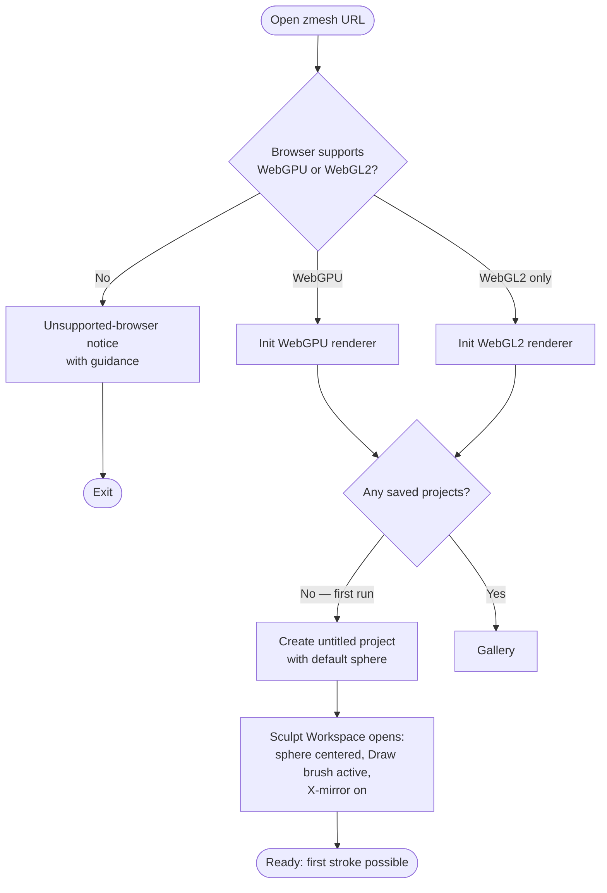
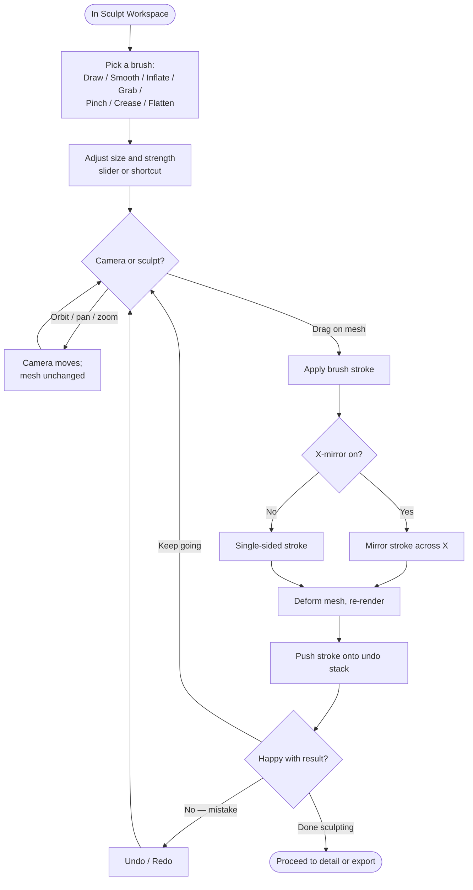
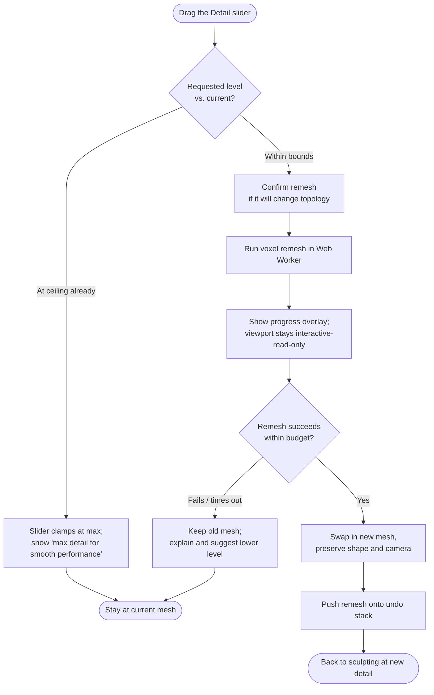
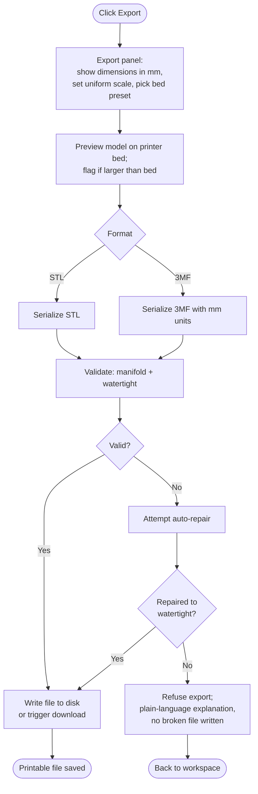
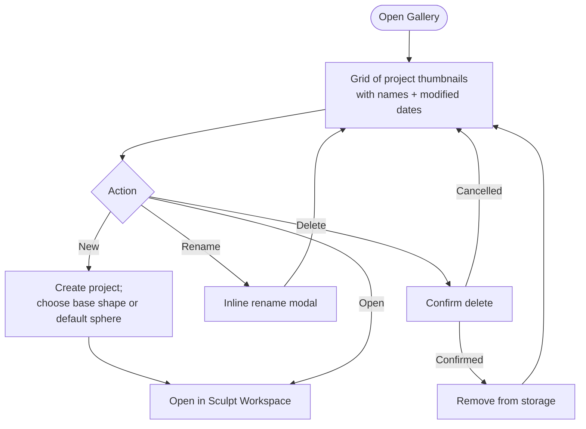
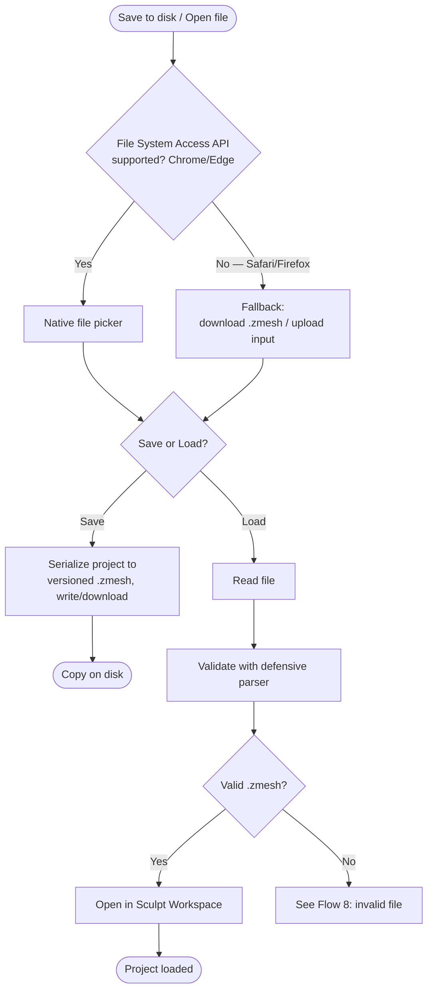
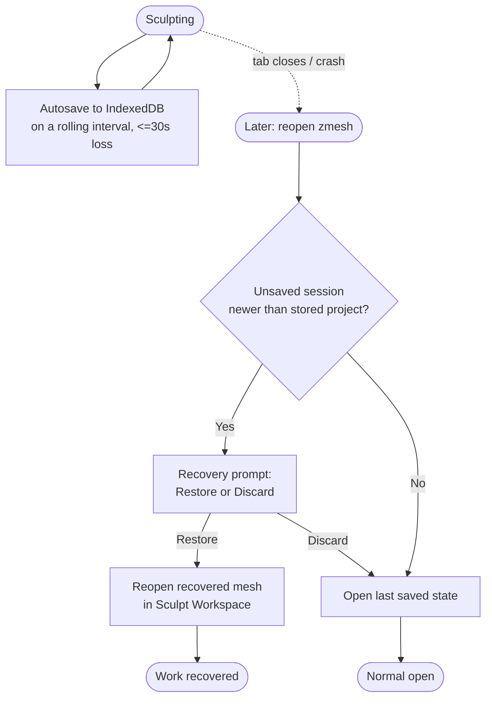
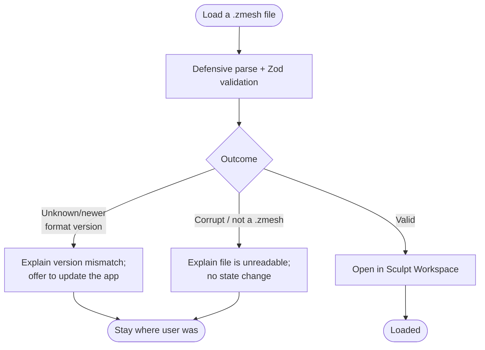

# User Flows: zmesh v1

**Source**: docs/requirements/zmesh-v1-requirements.md
**Status**: APPROVED
**Created**: 2026-07-19

**Review resolutions (2026-07-19)**: Camera-vs-brush input disambiguation deferred to wireframing. Oversized-for-bed is a warning, not a block. Duplicate-project stays COULD (FR-32), not diagrammed for v1.

zmesh is effectively a two-route single-page app: a **Gallery** (home) and a **Sculpt Workspace**. Everything else — export, save/load, rename, recovery — layers onto those as panels or modals. The viewport is not a "screen" you navigate away from; it is the workspace.

---

## Flow 1: First run & first sculpt

**Actor**: Hobbyist sculptor (first-time visitor)
**Goal**: Make a first stroke within seconds, with zero setup.
**Precondition**: No prior projects in browser storage.

**Key decision points**:
- Capability check gates everything; failure is a dead end with plain guidance, never a broken canvas.
- First run bypasses the gallery entirely — the app opens *in* the workspace on a fresh sphere (FR-01). The gallery is the landing only once at least one project exists.

**Screens involved**: Capability notice, Sculpt Workspace, Gallery.

---

## Flow 2: Core sculpting loop (happy path)

**Actor**: Hobbyist sculptor
**Goal**: Shape the mesh into the intended form.
**Precondition**: A project is open in the workspace.

**Key decision points**:
- Camera manipulation vs. sculpting is disambiguated by input (e.g. drag on empty space / modifier = camera; drag on mesh = brush). This is a spec-level interaction decision flagged for wireframing.
- Every stroke is atomic on the undo stack (FR-07, ≥50 steps).
- Autosave (Flow 7) runs continuously in the background throughout this loop.

**Screens involved**: Sculpt Workspace (brush toolbar, size/strength controls, symmetry toggle, undo/redo).

---

## Flow 3: Change detail / remesh

**Actor**: Hobbyist sculptor
**Goal**: Get finer resolution for detail work (or coarser for big-form blocking).
**Precondition**: A project is open.

**Key decision points**:
- The detail **ceiling** (BR-03) is a hard clamp derived from the 60 fps benchmark (open question Q-01), not a user override.
- Remesh is async and off the UI thread (NFR-03, ≤3 s at max); the app never freezes.
- A remesh is undoable like any other operation.

**Screens involved**: Sculpt Workspace (detail slider, remesh progress overlay).

---

## Flow 4: Export to printable file

**Actor**: Hobbyist sculptor
**Goal**: Get a watertight file that slices without repair.
**Precondition**: A project is open with a sculpted mesh.

**Key decision points**:
- Validation is the gate (BR-02): the app repairs or refuses — it never emits a broken mesh (FR-09, NFR-06).
- Oversized-for-bed is a **warning**, not a block — a user may be printing in pieces or on a larger printer (FR-11).
- 3MF is the SHOULD-cut format; if absent in a build, the format choice collapses to STL-only.

**Screens involved**: Sculpt Workspace, Export panel, Bed-preview, native/download save.

---

## Flow 5: Project gallery management

**Actor**: Hobbyist sculptor
**Goal**: Manage saved projects.
**Precondition**: At least one project exists (else see Flow 1).

**Key decision points**:
- Delete requires explicit confirmation (destructive, irreversible from the UI).
- "New" is where the base-shape gallery (FR-22, SHOULD) lives; the MUST default is a sphere.
- Thumbnails are generated on save/autosave from the viewport.

**Screens involved**: Gallery, New-project shape picker, Rename modal, Delete confirmation, Sculpt Workspace.

---

## Flow 6: Save & load to disk

**Actor**: Hobbyist sculptor
**Goal**: Keep a portable copy of a project, or open one.
**Precondition**: A project is open (save) or the app is running (load).

**Key decision points**:
- Two save surfaces by capability (NFR-05): native handle where available, download/upload elsewhere — same `.zmesh` format either way.
- Disk save is always an explicit user action and never overwritten by autosave (BR-05).

**Screens involved**: Sculpt Workspace, native/fallback file dialogs.

---

## Flow 7: Autosave & crash recovery

**Actor**: Hobbyist sculptor (returning after an unexpected close)
**Goal**: Not lose work.
**Precondition**: A session was interrupted (tab closed, crash) with unsaved changes.

**Key decision points**:
- Autosave target is IndexedDB, distinct from disk `.zmesh` (BR-05); at most ~30 s of work is ever at risk (FR-13).
- Undo history is *not* persisted (BR-04) — recovery restores mesh state, not the undo stack.

**Screens involved**: Sculpt Workspace, Recovery prompt.

---

## Flow 8: Load invalid / corrupt project file (error)

**Actor**: Hobbyist sculptor
**Goal**: Understand why a file won't open, without a crash.
**Precondition**: User attempts to load a `.zmesh` (or dropped file) that is corrupt, wrong-format, or an unsupported version.

**Key decision points**:
- Imported files are untrusted (NFR-08): a bad file never corrupts the current session or crashes the app.
- Errors are explained in plain language, not stack traces.

**Screens involved**: Gallery or Sculpt Workspace (wherever load was invoked), error toast/modal.

---

## Screen Inventory

| Screen / View | Description | Flows | Notes |
|---|---|---|---|
| Capability notice | Shown only when neither WebGPU nor WebGL2 is available | 1 | Terminal state; plain guidance |
| Gallery | Home grid of project thumbnails; entry to all project actions | 1, 5, 8 | Landing only when ≥1 project exists |
| New-project shape picker | Choose base shape (sphere default) | 5 | FR-22 (SHOULD); MUST path is silent default sphere |
| Sculpt Workspace | The core: viewport + brush toolbar + size/strength + symmetry + detail slider + undo/redo | 1–8 | The heart of the app; most sub-panels dock here |
| Detail remesh overlay | Progress indicator during async remesh | 3 | Non-blocking; viewport read-only meanwhile |
| Export panel | Dimensions (mm), scale, bed preset, format, bed preview | 4 | Includes oversized-for-bed warning |
| Save/Load file dialog | Native picker (Chrome/Edge) or download+upload fallback | 6 | Same `.zmesh` format both ways |
| Recovery prompt | Restore-or-discard after an interrupted session | 7 | Appears at open when unsaved work exists |
| Rename modal | Rename a project inline | 5 | |
| Delete confirmation | Confirm destructive project delete | 5 | |
| Error toast/modal | Validation-fail / invalid-file / export-refused messages | 4, 8 | Plain language, no crash |

---

## Navigation Structure

- **Entry points**: a single URL. First-ever visit → straight into the Sculpt Workspace on a fresh sphere. Returning visits → Gallery (or a Recovery prompt if a session was interrupted).
- **Primary navigation**: two logical routes — Gallery (`/`) and Sculpt Workspace (`/sculpt/:projectId`). Panels (export, detail, save/load) and modals (rename, delete, recovery, errors) layer over the workspace without navigating away — the viewport is never torn down mid-session.
- **Back / up navigation**: from the Workspace, a clear "back to gallery" affordance. Panels and modals dismiss with Escape / close, returning to the live viewport. The browser back button maps to the same gallery/workspace transitions.
- **Exit points**: completing a sculpt ends at either a saved `.zmesh` on disk, an exported printable file, or simply an autosaved project in the gallery. There is no logout or account boundary — closing the tab is a safe exit because of autosave.

---

## Notes for the spec

- Camera-vs-brush input disambiguation (Flow 2) is the single most important interaction to nail in wireframing; get it wrong and the tool feels broken to beginners.
- The detail ceiling (Flow 3 / BR-03) depends on the Q-01 benchmark; wireframes should show the slider with a defined max, value TBD by the spike.
- Oversized-for-bed is a warning, not a gate (Flow 4) — confirm this matches the mental model before spec.
